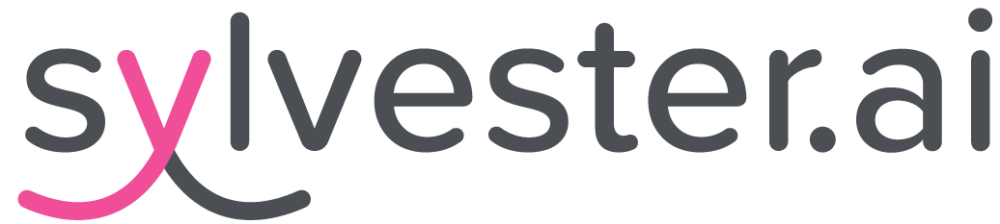

  

# Sylvester

## About Us

Sylvester is an AI/Machine Learning company dedicated to advancing the understanding of feline behavior through cutting-edge technology. We specialize in creating sophisticated behavioral prediction models that help decode and anticipate cat behavior patterns.

## Our Focus

Our core expertise lies in the feline space, where we develop:

- **Behavioral Prediction Models**: Advanced machine learning algorithms that analyze and predict cat behavior patterns
- **AI-Driven Insights**: Deep learning systems that help understand the nuances of feline psychology and actions
- **Data-Driven Solutions**: Leveraging artificial intelligence to provide actionable insights into cat behavior

## Mission

We're committed to bridging the gap between humans and their feline companions through innovative AI technology, making it easier to understand, predict, and respond to cat behavior in meaningful ways.

## Model Cards

Explore our published AI models and their detailed documentation:

- [Behavioral Classification Model v2.1](models/model-card-bc-v2-1.md)
